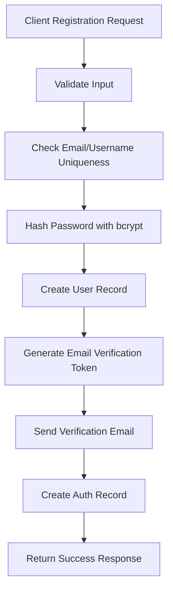
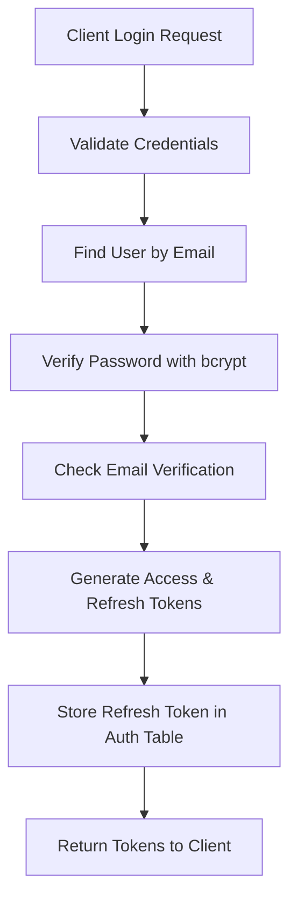
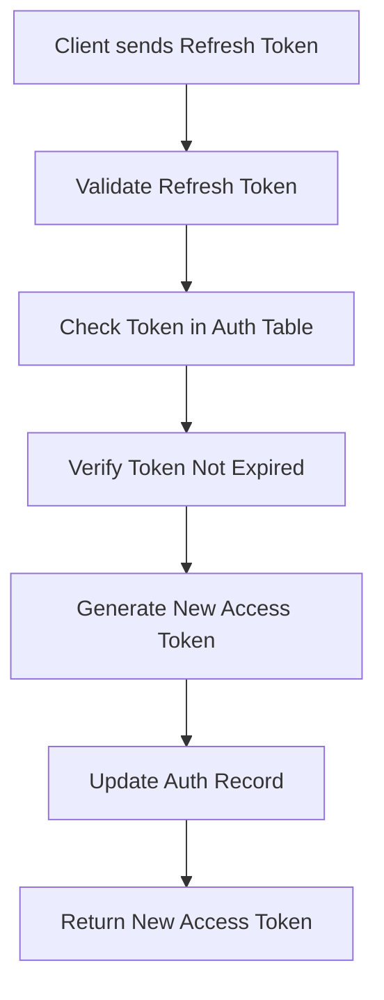
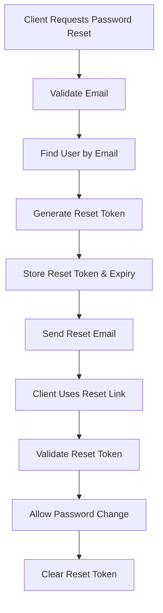

# Authentication System Planning Document

## Overview

This document outlines the comprehensive authentication system for the Videa-Mozi application, implementing secure user authentication with refresh tokens, password reset functionality, and middleware protection.

## Current Project State Analysis

### Backend Infrastructure

- **Framework**: Express.js with TypeScript
- **Database**: PostgreSQL with Prisma ORM
- **Authentication Libraries**: bcrypt, jsonwebtoken
- **Validation**: class-validator, zod

### Database Schema

- **Users Model**: Basic user information (id, email, username, password, roles)
- **Auth Model**: Token management (token, expiresAt, userId, isOnline, isVerified, lastSeen, passwordResetTime)

### Existing Components

- Basic user creation controller
- JWT utility functions (generate, validate, refresh)
- Express server setup with CORS, Helmet, Morgan

## Authentication Flow Architecture

### 1. Registration Flow



### 2. Login Flow



### 3. Token Refresh Flow



### 4. Password Reset Flow



## Implementation Plan

### Phase 1: Core Authentication Backend

#### 1.1 Environment Variables Setup

```bash
# Add to .env
JWT_ACCESS_SECRET=your-access-secret-key
JWT_REFRESH_SECRET=your-refresh-secret-key
JWT_ACCESS_EXPIRE=15m
JWT_REFRESH_EXPIRE=7d
EMAIL_SERVICE=gmail
EMAIL_USER=your-email@gmail.com
EMAIL_PASS=your-app-password
FRONTEND_URL=http://localhost:3031
```

#### 1.2 Enhanced Database Schema

```prisma
model Users {
  id       Int    @id @default(autoincrement())
  email    String @unique
  username String @unique
  password String
  roles    Roles  @default(USER)
  isEmailVerified Boolean @default(false)
  Auth     Auth[]
  created_at DateTime @default(now())
  updated_at DateTime @updatedAt
}

model Auth {
  id        Int      @id @default(autoincrement())
  accessToken String @unique
  refreshToken String @unique
  expiresAt DateTime
  refreshExpiresAt DateTime
  userId    Int
  users     Users    @relation(fields: [userId], references: [id])
  isOnline  Boolean  @default(false)
  lastSeen   DateTime
  passwordResetToken String?
  passwordResetExpires DateTime?
  emailVerificationToken String?
  emailVerificationExpires DateTime?
}
```

#### 1.3 Authentication Controller

**File**: `src/controllers/authController.ts`

**Functions to implement**:

- `register` - User registration with email verification
- `login` - User login with token generation
- `logout` - Token invalidation
- `refreshToken` - Access token refresh
- `verifyEmail` - Email verification
- `forgotPassword` - Password reset request
- `resetPassword` - Password reset confirmation
- `changePassword` - Authenticated password change

#### 1.4 Authentication Middleware

**File**: `src/middlewares/auth.ts`

**Middleware functions**:

- `authenticateToken` - Verify access token
- `authorizeRoles` - Role-based authorization
- `optionalAuth` - Optional authentication for public endpoints
- `refreshTokenAuth` - Validate refresh token

#### 1.5 Email Service

**File**: `src/utils/email.ts`

**Features**:

- Email verification templates
- Password reset templates
- Email sending utility
- Template management

#### 1.6 Validation Schemas

**File**: `src/validators/authValidators.ts`

**Validation schemas**:

- Registration validation
- Login validation
- Password reset validation
- Password change validation

### Phase 2: Enhanced JWT Utilities

#### 2.1 Token Management

**File**: `src/utils/jwt/token.ts` (Enhanced)

**Additional functions**:

- `generateAccessToken(user: User)` - Generate short-lived access token
- `generateRefreshToken(user: User)` - Generate long-lived refresh token
- `verifyAccessToken(token: string)` - Verify access token
- `verifyRefreshToken(token: string)` - Verify refresh token
- `generateEmailVerificationToken()` - Generate email verification token
- `generatePasswordResetToken()` - Generate password reset token

#### 2.2 Token Storage Service

**File**: `src/services/tokenService.ts`

**Functions**:

- `storeRefreshToken(userId, refreshToken, expiry)`
- `findRefreshToken(refreshToken)`
- `invalidateRefreshToken(refreshToken)`
- `invalidateAllUserTokens(userId)`
- `cleanupExpiredTokens()`

### Phase 3: Authentication Routes

#### 3.1 Auth Routes

**File**: `src/routes/auth.ts`

**Endpoints**:

```typescript
POST / api / v1 / auth / register
POST / api / v1 / auth / login
POST / api / v1 / auth / logout
POST / api / v1 / auth / refresh
POST / api / v1 / auth / verify - email
POST / api / v1 / auth / forgot - password
POST / api / v1 / auth / reset - password
POST / api / v1 / auth / change - password
GET / api / v1 / auth / me
```

### Phase 4: Frontend Authentication

#### 4.1 Authentication Context

**File**: `app/contexts/AuthContext.tsx`

**Features**:

- User state management
- Token storage (localStorage/sessionStorage)
- Automatic token refresh
- Login/logout handlers
- Protected route wrapper

#### 4.2 Custom Hooks

**File**: `app/hooks/useAuth.ts`

**Hooks**:

- `useAuth()` - Access authentication state
- `useRequireAuth()` - Require authentication for component
- `useRequireRole()` - Require specific role

#### 4.3 API Client

**File**: `app/lib/api/auth.ts`

**Functions**:

- `login(credentials)`
- `register(userData)`
- `logout()`
- `refreshToken()`
- `forgotPassword(email)`
- `resetPassword(token, newPassword)`
- `changePassword(currentPassword, newPassword)`
- `verifyEmail(token)`

#### 4.4 Protected Route Component

**File**: `app/components/auth/ProtectedRoute.tsx`

**Features**:

- Route protection wrapper
- Redirect to login if unauthenticated
- Role-based route protection
- Loading states

#### 4.5 Authentication Forms

**Files**:

- `app/components/auth/LoginForm.tsx`
- `app/components/auth/RegisterForm.tsx`
- `app/components/auth/ForgotPasswordForm.tsx`
- `app/components/auth/ResetPasswordForm.tsx`
- `app/components/auth/ChangePasswordForm.tsx`

### Phase 5: Security Enhancements

#### 5.1 Rate Limiting

**File**: `src/middlewares/rateLimit.ts`

**Features**:

- Login attempt rate limiting
- Password reset rate limiting
- General API rate limiting

#### 5.2 Security Headers

**File**: `src/middlewares/security.ts`

**Features**:

- CORS configuration
- Helmet security headers
- XSS protection
- CSRF protection

#### 5.3 Logging & Monitoring

**File**: `src/middlewares/logging.ts`

**Features**:

- Authentication event logging
- Failed login attempt tracking
- Security event monitoring

### Phase 6: Testing & Documentation

#### 6.1 Unit Tests

**Files**:

- `tests/controllers/authController.test.ts`
- `tests/middlewares/auth.test.ts`
- `tests/utils/jwt.test.ts`
- `tests/services/tokenService.test.ts`

#### 6.2 Integration Tests

**Files**:

- `tests/integration/auth-flow.test.ts`
- `tests/integration/password-reset.test.ts`

#### 6.3 API Documentation

**File**: `docs/api/auth-api.md`

**Documentation**:

- Authentication endpoints
- Request/response examples
- Error codes
- Rate limiting information

## Security Considerations

### 1. Token Security

- Access tokens: 15-minute expiry
- Refresh tokens: 7-day expiry
- Secure token storage in database
- Token rotation on refresh
- Automatic cleanup of expired tokens

### 2. Password Security

- bcrypt with appropriate rounds (12)
- Minimum password requirements
- Password history prevention
- Secure password reset flow

### 3. Session Management

- Single active session per user (optional)
- Session timeout handling
- Device tracking (future enhancement)
- Logout from all devices option

### 4. Rate Limiting

- 5 login attempts per 15 minutes
- 3 password reset requests per hour
- Progressive delays on failed attempts

### 5. Data Protection

- Sensitive data encryption at rest
- Secure transmission (HTTPS only)
- GDPR compliance considerations
- Data retention policies

## Implementation Timeline

### Week 1: Core Backend Setup

- [ ] Enhance database schema
- [ ] Create authentication controller
- [ ] Implement basic JWT functions
- [ ] Set up middleware structure

### Week 2: Authentication Flow

- [ ] Implement registration/login/logout
- [ ] Create auth routes
- [ ] Add token refresh functionality
- [ ] Implement email verification

### Week 3: Password Management

- [ ] Password reset flow
- [ ] Password change functionality
- [ ] Email service integration

### Week 4: Security & Testing

- [ ] Add rate limiting
- [ ] Implement security middleware
- [ ] Create comprehensive tests
- [ ] Security audit

### Week 5: Frontend Integration

- [ ] Create auth context
- [ ] Build authentication forms
- [ ] Implement protected routes
- [ ] Add API client

### Week 6: Enhancement & Optimization

- [ ] Performance optimization
- [ ] Error handling improvements
- [ ] Documentation completion
- [ ] Final testing

## Future Enhancements

### 1. Advanced Security

- Multi-factor authentication (MFA)
- Device fingerprinting
- Suspicious activity detection
- Security event notifications

### 2. Social Authentication

- OAuth integration (Google, GitHub)
- Social login flows
- Account linking

### 3. Session Management

- Multiple device management
- Session analytics
- Device approval flow

### 4. Compliance & Audit

- Audit logging
- GDPR compliance features
- Data export/deletion
- Privacy controls

## Conclusion

This authentication system provides a solid foundation for secure user management with modern best practices including JWT tokens, refresh token rotation, password reset functionality, and comprehensive security measures. The modular design allows for easy extension and maintenance.

The implementation follows industry standards and includes proper error handling, validation, rate limiting, and security headers to protect against common vulnerabilities.
